##  Users & Roles

-   Splunk uses Role based access control - RBAC

-   Settings --> Users & Authentication
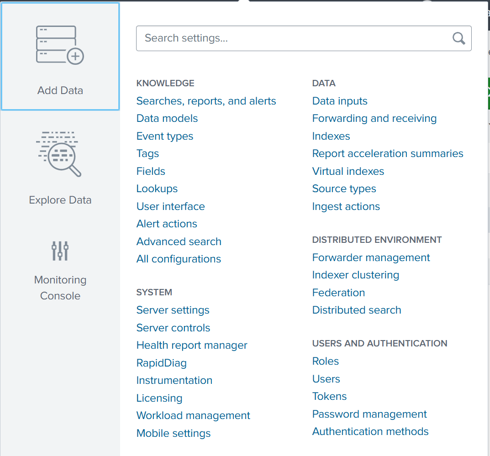

-   To create a native user in Splunk
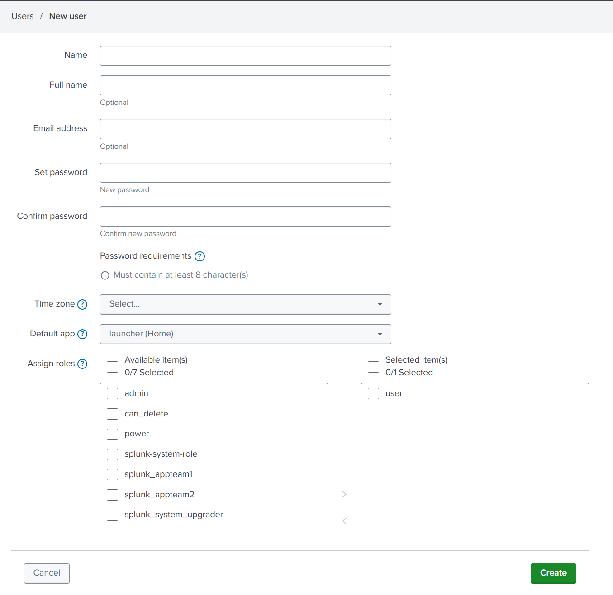

-   Roles:
```
Roles are assigned to users, and at least one role must be assigned to a user. Roles contain a list of capabilities that defines which actions users can perform on the Splunk platform. In other words, capabilities are nothing but a list of permissions given to a role—for example, run a search, run a scheduled search, run a real-time search, and so on.


Along with capabilities, a role provides configurable options for which indexes the user is allowed to query, to restrict them further through a search filter approach, and to set quotas such as disk-space limit and user-level search limits.
```
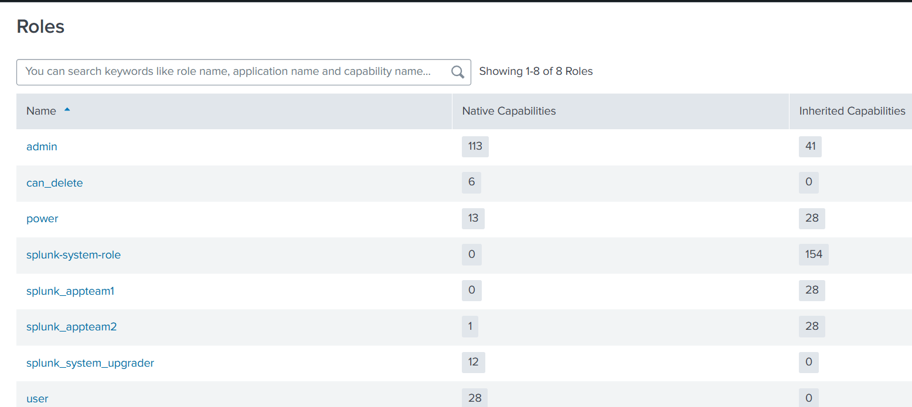

-   New role creation
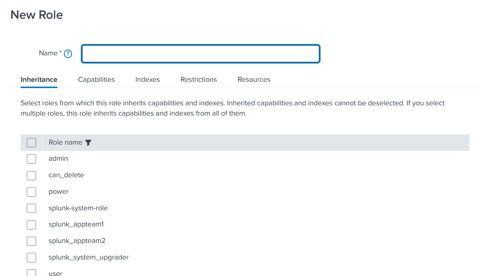
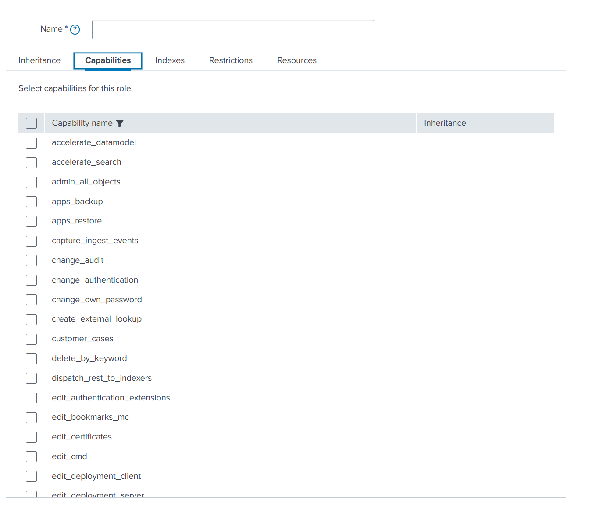
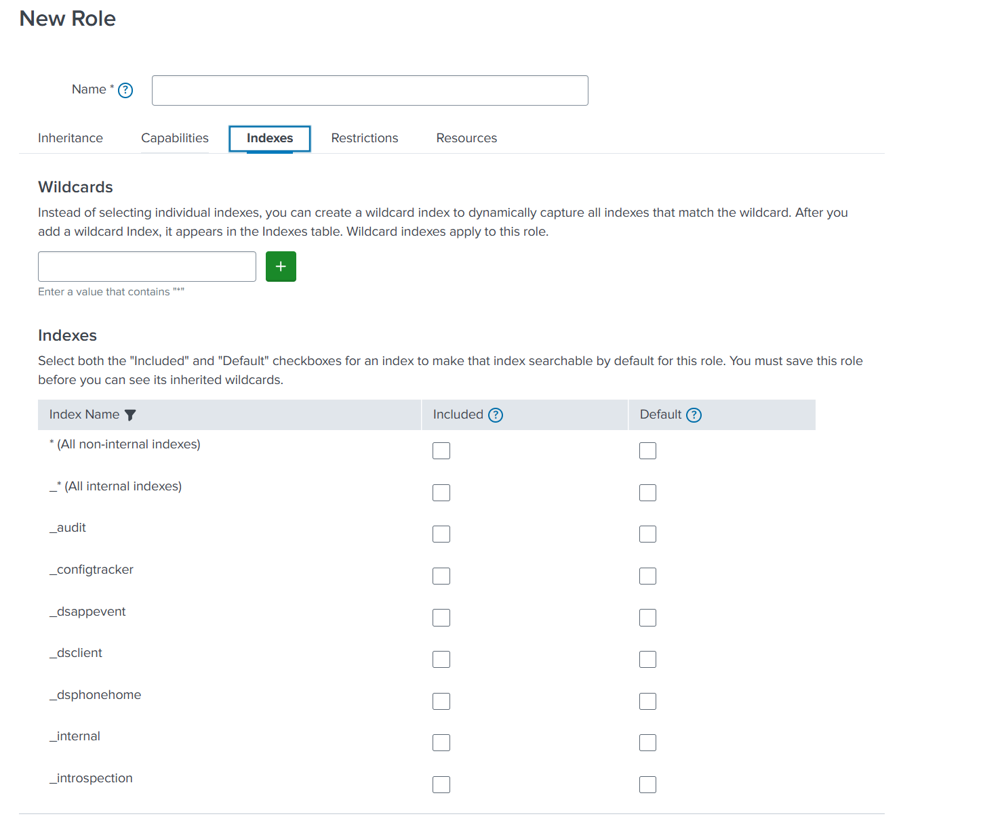
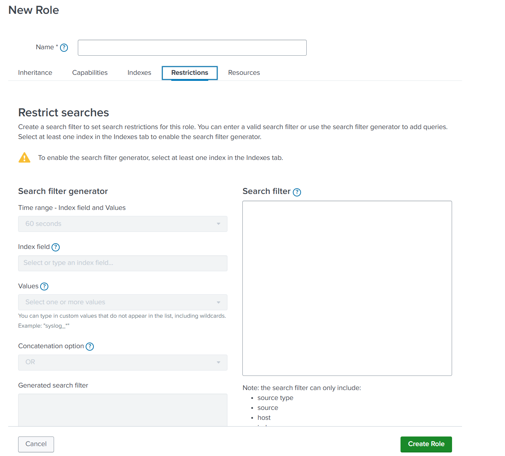
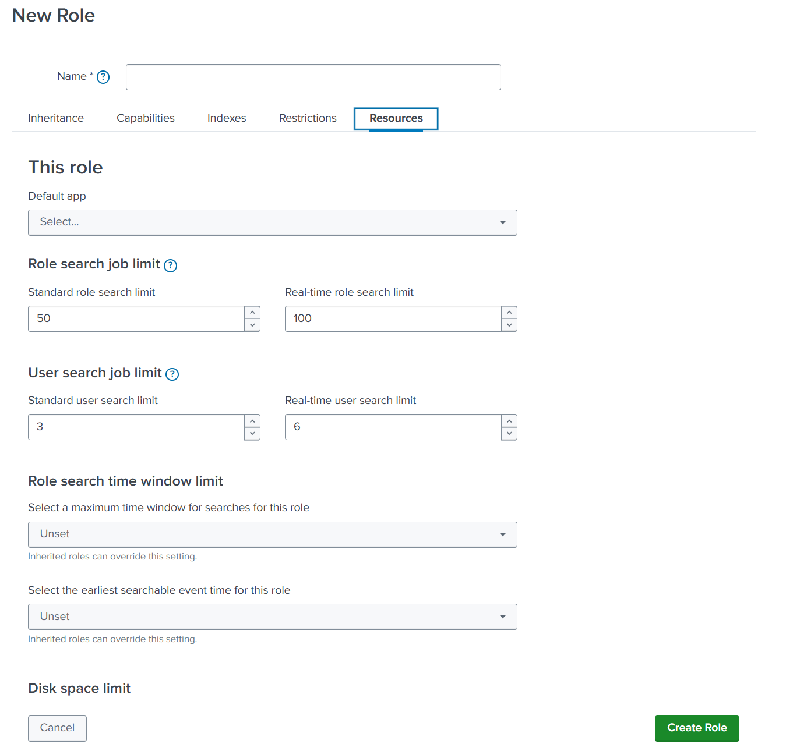


-   To reload authentication and authorize.conf can be reloaed with out need of restarting splunk
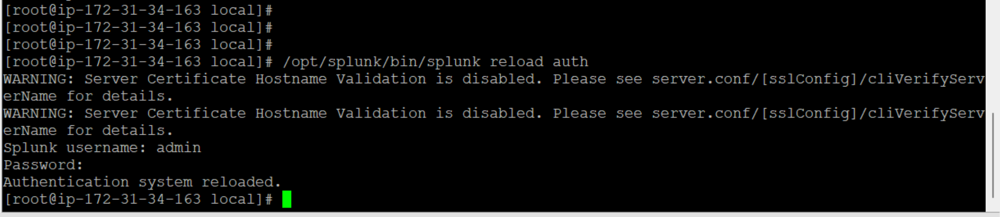
----
-   authentication.conf

https://help.splunk.com/en/data-management/splunk-enterprise-admin-manual/9.1/configuration-file-reference/9.1.3-configuration-file-reference/authentication.conf#authentication.conf.example-0

-   authorize.conf

https://help.splunk.com/en/data-management/splunk-enterprise-admin-manual/9.1/configuration-file-reference/9.1.3-configuration-file-reference/authorize.conf

----

####    To reset admin credentials
```
To update or reset admin pwd
take backup of /opt/splunk/etc/passwd to /opt/splunk/etc/passwd.bak
then edit/create the /opt/splunk/etc/system/local/user-seed.conf file with below content and restart splunkd service. This will reset the admin password to "mypassword1234"
user-seed.conf
[user_info]
USERNAME = admin
PASSWORD = mypassword1234
```
----
----
----

## Field Extractions
-   Field names are case sensitive
-    index time vs search time field extraction


----
----
----

##  Lookups
These are used for enriching data in splunk with additional information.
-   csv lookups - stored in a csv file under .../etc/apps/APPNAME/lookups
       -   lookup table
       -    lookup definition
       -    automated lookups
    >   To search data of lookup (|inputlookup LOOKUPNAME.csv)
-   KVStore lookups -- data is stored in mongodb
    -   KV Store lookups require a collection to be created upfront before the creation of a lookup definition.
Splunk Web doesn’t offer the creation of collections through the UI. Instead, a Splunk-supported app – Splunk App for Lookup file editing (aka Lookup Editor) – at splunkbase.com helps to create it.
    -   in backend it creates collections.conf and tranforms.conf
-   External lookups
    -   External lookups, also called scripted lookups, fetch additional information for events in Splunk by connecting to external sources such as APIs.
-   Geospatial lookups
    -   contain geospatial information such as the longitude and latitude related to a place in the world. By default, Splunk ships with US information and worldwide countries’ information. You can issue a search request in the Search and Reporting app – | inputlookup geo_countries – and click on the Visualization tab, and then choose Choropleth Map.


```
| makeresults 
| eval ip = "1.2.3.4", message="DDOs attack" 
| lookup hostname_test.csv ip as ip
```

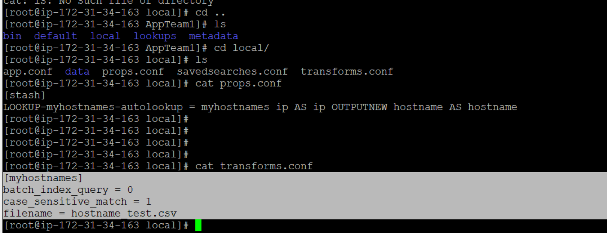

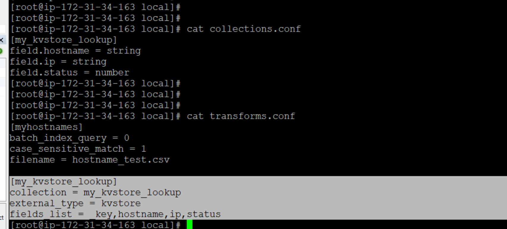