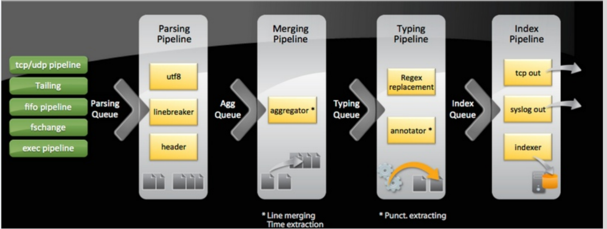
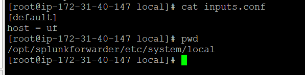
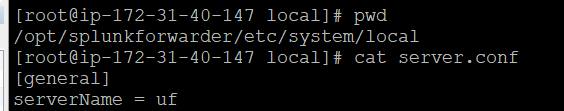
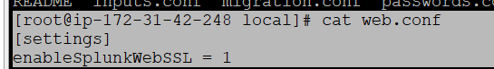
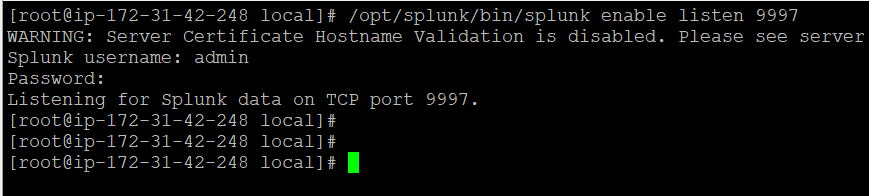
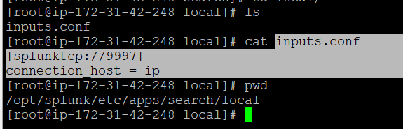
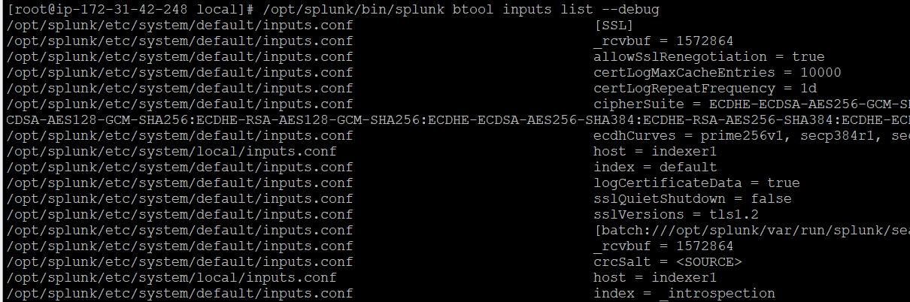

### Splunk Data Processing in Pipelines and Queues



### Splunk folder structure
```
.
├── README-splunk.txt
├── bin
│   ├── splunk
├── copyright.txt
├── etc
│   ├── apps
│   │   ├── SplunkUniversalForwarder
│   │   ├── audit_trail
│   │   ├── introspection_generator_addon
│   │   ├── journald_input
│   │   ├── learned
│   │   ├── search
│   │   ├── splunk_httpinput
│   │   └── splunk_internal_metrics
│   ├── auth
│   │   ├── appsCA.pem
│   │   ├── ca.pem
│   │   ├── ca.pem.default
│   │   ├── ca.srl
│   │   ├── cacert.pem
│   │   ├── cacert.pem.default
│   │   ├── cloudCA.pem
│   │   ├── crl
│   │   ├── dp_ca.pem
│   │   ├── dp_ca.srl
│   │   ├── prev_release
│   │   ├── scripts
│   │   ├── server.pem
│   │   ├── server_dp.pem
│   │   └── splunk.secret
│   ├── copyright.txt
│   ├── datetime.xml
│   ├── deployment-apps
│   │   └── README
│   ├── disabled-apps
│   │   └── README
│   ├── init.d
│   │   └── README
│   ├── instance.cfg
│   ├── licenses
│   │   └── forwarder
│   ├── log-btool-debug.cfg
│   ├── log-btool.cfg
│   ├── log-cmdline-debug.cfg
│   ├── log-cmdline.cfg
│   ├── log-debug.cfg
│   ├── log-tlsproxy.cfg
│   ├── log-utility.cfg
│   ├── log.cfg
│   ├── manager-apps
│   │   └── _cluster
│   ├── modules
│   │   ├── input
│   │   ├── output
│   │   └── parsing
│   ├── myinstall
│   │   ├── splunkd.xml
│   │   └── splunkd.xml.cfg-default
│   ├── passwd
│   ├── prettyprint.xsl
│   ├── shcluster
│   │   ├── apps
│   │   └── users
│   ├── splunk-launch.conf
│   ├── splunk-launch.conf.default
│   ├── splunk.version
│   ├── system
│   │   ├── README
│   │   ├── bin
│   │   ├── default
│   │   ├── local
│   │   ├── metadata
│   │   └── static
│   └── users
│       ├── users.ini
│       └── users.ini.default
├── include
│   └── copyright.txt
├── lib
│   ├── copyright.txt
│   ├── engines-3
│   │   ├── afalg.so
│   ├── libz.so.1
│   ├── libz.so.1.2.11
│   ├── ossl-modules
│   │   ├── fips140-2
│   │   ├── fips140-3
│   │   └── legacy.so
│   ├── pcre2_wx
│   │   ├── libpcre2-8.so -> ../libpcre2-8.so
│   │   ├── libpcre2-8.so.0 -> ../libpcre2-8.so.0
│   │   └── libpcre2-8.so.0.11.0 -> ../libpcre2-8.so.0.11.0
│   └── remoteApps
│       ├── app_listing
│       ├── install_app
│       └── uploaded_apps
├── license-eula.txt
├── openssl
│   └── copyright.txt
├── opt
│   ├── jemalloc-4k-nostats
│   │   ├── include
│   │   └── lib
│   ├── jemalloc-4k-prof
│   │   ├── include
│   │   └── lib
│   ├── jemalloc-4k-stats
│   │   ├── include
│   │   └── lib
│   └── openssl1
│       ├── bin
│       ├── lib
│       └── openssl
├── splunkforwarder-10.2.0-d749cb17ea65-linux-amd64-manifest
├── swidtag
│   └── splunk-UniversalForwarder-primary.swidtag
└── var
    ├── lib
    │   └── splunk
    ├── log
    │   ├── client_events
    │   ├── introspection
    │   ├── splunk
    │   └── watchdog
    ├── run
    │   └── splunk
    └── spool
        ├── dirmoncache
        └── splunk


```

```
https://help.splunk.com/en/splunk-enterprise/forward-and-process-data/universal-forwarder-manual/9.4/working-with-the-universal-forwarder/manage-a-linux-least-privileged-user

/opt/splunkforwarder/bin/splunk enable boot-start -user root


[root@ip-172-31-40-147 splunkforwarder]# useradd -m -s /bin/bash splunk
[root@ip-172-31-40-147 splunkforwarder]# id splunk
uid=1001(splunk) gid=1001(splunk) groups=1001(splunk)


[root@ip-172-31-40-147 system]# /opt/splunkforwarder/bin/splunk enable boot-start -user root
Overwriting present value (splunk) of 'SPLUNK_OS_USER' in /opt/splunkforwarder/etc/splunk-launch.conf
Systemd unit file installed by user at /etc/systemd/system/SplunkForwarder.service.
Configured as systemd managed service.
[root@ip-172-31-40-147 system]#
[root@ip-172-31-40-147 system]#
[root@ip-172-31-40-147 system]#
[root@ip-172-31-40-147 system]#
[root@ip-172-31-40-147 system]# systemctl start SplunkForwarder.service
[root@ip-172-31-40-147 system]# systemctl status SplunkForwarder.service
● SplunkForwarder.service - Systemd service file for Splunk, generated by 'splunk enable boot-start'
     Loaded: loaded (/etc/systemd/system/SplunkForwarder.service; enabled; preset: disabled)
     Active: active (running) since Fri 2026-01-30 05:29:24 UTC; 7s ago


```

TO change servername and hostname


>   Default Hostname:



-   $SPLUNK_HOME/bin/splunk set default-hostname <YOURHOSTNAME>


>Servername:


-   $SPLUNK_HOME/bin/splunk set servername <YOURHOST/ServerNAME>

> To enable SPlunk HTTPS/web ssl



-   /opt/splunk/bin/splunk enable web-ssl


### Enable listening/Receiving port 9997 on indexer
-    /opt/splunk/bin/splunk enable listen 9997




### Btool utility




### Splunk Docs for Config files

https://help.splunk.com/en/splunk-enterprise/administer/admin-manual/9.4/configuration-file-reference/9.4.0-configuration-file-reference/inputs.conf