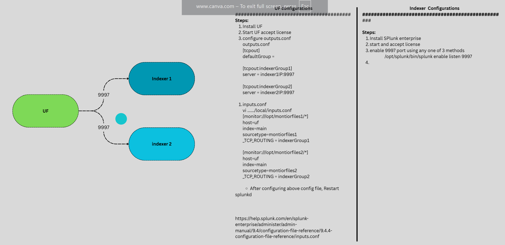

# UF --> Indexer
UF to INDEXER


### Prerequisites:
UF
-   Install Splunk UF package ( untar & start splunk process)
-   check connectivity to indexer on port 9997

Indexer
-   install Splunk Enterprise (untar & start splunk process)
-   Enable 9997 receiving port on this instance
-   to enable receiving port on indexer over 9997

Method1 -- UI/web based
1. Login to SPlunk web
2. Go to Setttings --> Data(forwarding & receiving)
 enable receiving by clicking on add item --> add 9997 and save it
 
Method2 -- CLI based
```
/opt/splunk/bin/splunk enable listen 9997
```

Method3 ( if you follow this method you have restart splunkd)
config based
```
inputs.conf
[splunktcp://9997]
connection_host = ip
```

check if splunkd is listening on 9997
-   netstat -anp|grep :9997
-   check firewall if indexer is listening on 9997

Steps:
1. Login to UF CLI
2. check if splunkd process is running
3. /opt/splunkforwarder/bin/splunk status

4. Create a file outputs.conf in /opt/splunkforwarder/etc/system/local/

https://help.splunk.com/en/splunk-enterprise/administer/admin-manual/9.4/configuration-file-reference/9.4.4-configuration-file-reference/outputs.conf#outputs.conf.example-0
5. vi /opt/splunkforwarder/etc/system/local/outputs.conf
```
[tcpout]
defaultGroup = splunksession

[tcpout:splunksession]
server = <indexerIP>:9997
```
6. Create a file  inputs.conf in /opt/splunkforwarder/etc/system/local/
and a file to monitor the data /opt/splunkforwarder/testfile.log.
7. vi /opt/splunkforwarder/etc/system/local/inputs.conf
```
[monitor:///opt/splunkforwarder/testfile.log]
index = main
sourcetype=test_access
#_TCP_ROUTING = splunksession ⟶ if you want to send data to specific group.
```

