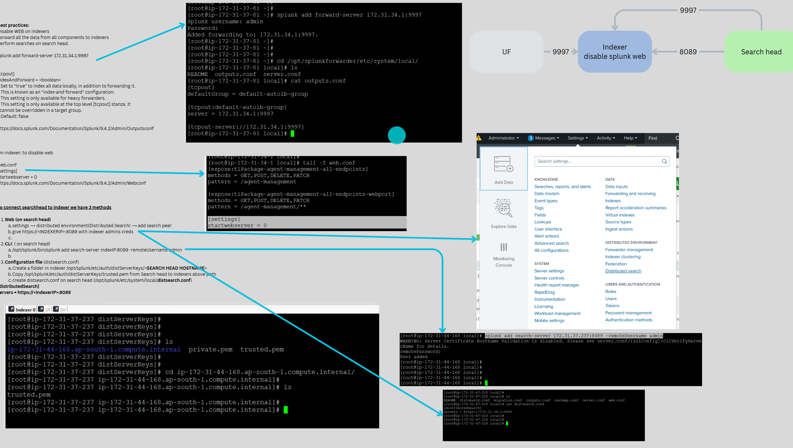

##  UF - Indexer - Search Head


### Best practices:
-   Disable WEB on indexers
-   Forward all the data from all components to indexers
-   Perform searches on search head.

- To forward data to indexer 
```  
Command to forward data to indexer
splunk add forward-server <INDEXERIP>:9997

config Method:
vi $SPLUNK_HOME/etc/system/local/outputs.conf

[tcpout]
defaultGroup = splunksession

[tcpout:splunksession]
server = <INDEXERIP>:9997
```

-   To disable indexing on non indexer nodes set index to false under indexAndForward stanza in outputs.conf
```
vi $SPLUNK_HOME/etc/system/local/outputs.conf
[indexAndForward]
index=false

[tcpout]
indexAndForward = alsef
* Set to "true" to index all data locally, in addition to forwarding it.
* This is known as an "index-and-forward" configuration.
* This setting is only available for heavy forwarders.
* This setting is only available at the top level [tcpout] stanza. It
  cannot be overridden in a target group.
* Default: false

# https://docs.splunk.com/Documentation/Splunk/9.4.2/Admin/Outputsconf
```


-   On indexer: to disable web
```
web.conf
[settings]
startwebserver = 0
https://docs.splunk.com/Documentation/Splunk/9.4.2/Admin/Webconf
```
----

### To connect searchhead to indexer we have 3 methods

1.  Web (on search head)
```
settings ⟶ distributed environment(Distributed Search) ⟶ add search peer 
give https://<INDEXERIP>:8089 with indexer admins creds
```

2.  CLI: ( on search head)
```
/opt/splunk/bin/splunk add search-server indexIP:8089 -remoteUsername admin
```

3.  Configuration file (distsearch.conf) --> Not suggested
```
Create a folder in indexer /opt/splunk/etc/auth/distServerKeys/<SEARCH HEAD HOSTNAME>
Copy /opt/splunk/etc/auth/distServerKeys/trusted.pem from Search head to indexers above path
create distsearch.conf on search head (/opt/splunk/etc/system/local/distsearch.conf)
[distributedSearch]
servers = https://<indexerIP>:8089
```





```