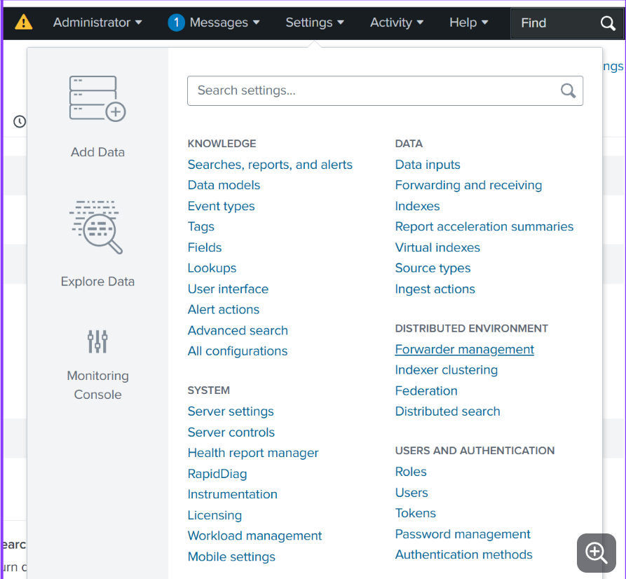
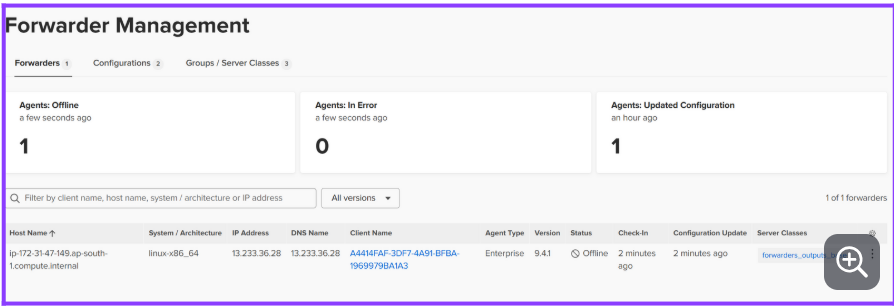
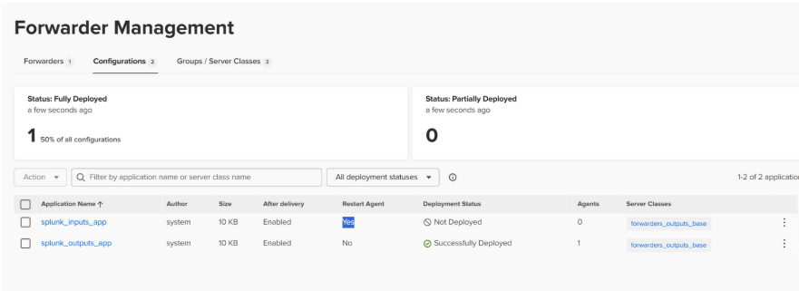
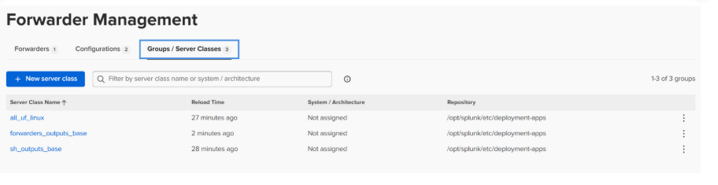
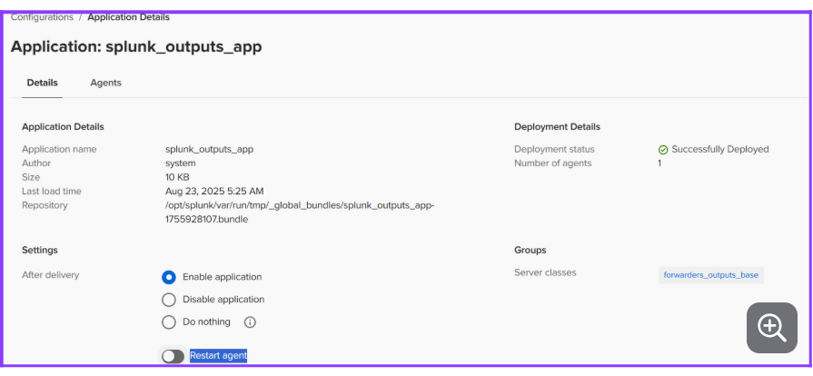
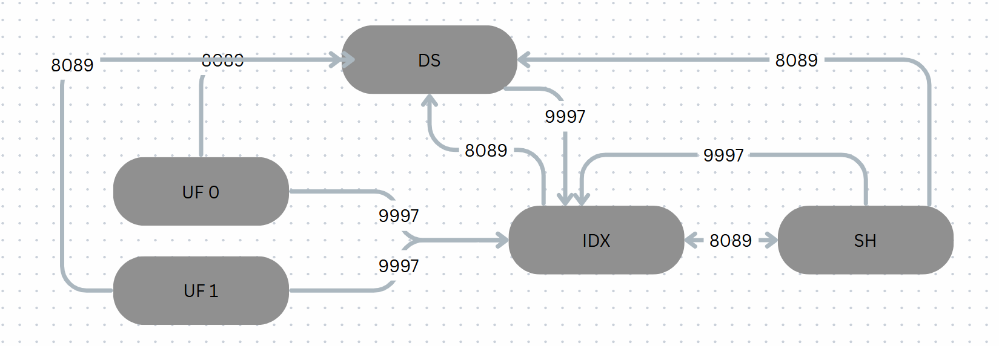

1. Install splunk package on the VMs & start splunk (follow best practices)
2. Configure Deploymentclient on Non DS instances to poll Deployment Server to download configurations
```
$SPLUNK_HOME/bin/splunk set deploy-poll <deploymentserver>:8089 --> this will create deploymentclient.conf

        OR
    
create deploymentclient.conf directly under .../etc/system/local OR .../etc/apps/<ANYAPP>/local/

[deployment-client]
phoneHomeIntervalInSecs = 60 #⟶ can be changed based on # of client reporting to DS

[target-broker:deploymentServer]
targetUri= https://<DEPLOYMENTSERVER>:8089
```
    

3. Login to DS --> settings --> forwarder/agent management; --> you will see instances under forwarders/clients


4. Login to DS CLI and Create all  configs that needs on clients like outputs inputs server props transforms by creating one or more apps as needed
```
Example: This app need to be deployed to all UFs, HFs, SHs (NON indexer instances)
$SPLUNK_HOME/etc/deployment-apps/splunk_outputs_app/{local,dafault}/outputs.conf
[tcpout]
defaultGroup = indexer_grp

[tcpout:indexer_grp]
server = indexer1p:9997,indexer2p:9997


Example: This app need to be deployed to all UFs
$SPLUNK_HOME/etc/deployment-apps/uf_inputs_app/{local,dafault}/inputs.conf
[monitor://<PATH TO MONITOR>]
index=main
sourcetype=myst

# add more stanzas as required by app teams
```
5. Once apps are created in DS under `$SPLUNK_HOME/etc/deployment-apps/` login to web on DS --> settinsg --> forwarder/agent management; You will notice apps are visible under `Configurations`


6. Map Apps and Clients by creating Serverclass & enable splunkd restart for UF apps to restart 
Splunk on UF when there are any config changes




7. To reload a specific serverclass to intimate DS and clients that there are updates to configs/new app(s) added to serverclass
```
$SPLUNK_HOME/bin/splunk reload deploy-server -class <serverclassname>
```


