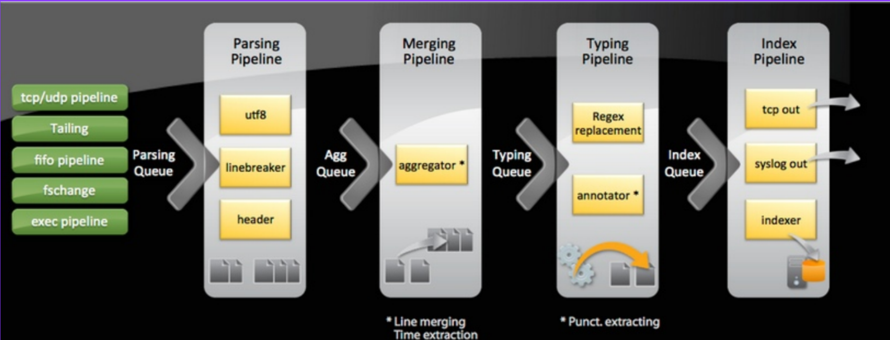

https://help.splunk.com/en/splunk-enterprise/spl-search-reference/10.0/time-format-variables-and-modifiers/date-and-time-format-variables


https://quickref.me/regex.html


------
```


13.126.183.188 - hf
65.0.168.244 - idx2
13.127.162.118 - idx1
3.110.133.196 uf


UF:
outputs.conf
[tcpout]
defaultGroup = hfgroup

[tcpout:hfgroup]
server = 13.126.183.188:9997


inputs.conf
[monitor:///opt/monitor/secure.log]
index=main
sourcetype=secure_access


=========================================
HF:

props.conf
[secure_access]
SHOULD_LINEMERGE=false
LINE_BREAKER=([\r\n]+)
TIME_FORMAT=%a %b %d %Y %H:%M:%S
TIME_PREFIX=^
TZ=Asia/Kolkata
# SEDCMD-maskpwd=s/(Failed\s)(\w+)/\1XXXXXXX/g
TRANSFORMS-maskdata = maskpwd


[access_log]
SHOULD_LINEMERGE=false
LINE_BREAKER=([\r\n]+)(?:\d{1,3}\.\d{1,3}\.\d{1,3}\.\d{1,3}\s\-\s\-\s\[)
TIME_PREFIX=\-\s\-\s\[
TIME_FORMAT=%d/%b/%Y:%H:%M:%S
TZ=America/New_York
TRANSFORMS-extractip = extractip
TRANSFORMS-rouettobanana = route_to_banana
TRANSFORMS-sendtonullqueue = sendtonullqueue


[vendor_sales]
SHOULD_LINEMERGE=false
LINE_BREAKER=([\r\n]+)(\[\d{1,2}\/\w{3}\/\d{4}:\d{1,2}:\d{1,2}\:\d{1,2}\])
NO_BINARY_CHECK=true
CHARSET=UTF-8
TIME_FORMAT=%d/%b/%Y:%H:%M:%S
TIME_PREFIX=^\[
TRANFORMS-route_to_idx2 = route_to_idx2,route_to_apple


transforms.conf
[route_to_idx2]
REGEX = CODE\=A
DEST_KEY = _TCP_ROUTING_
FORMAT = idx2group


[routetoNullqueeue]
REGEX = CODE\=A
DEST_KEY = queue
FORMAT = nullQueue


[maskpwd]
REGEX = (Failed\s)(\w+)()
FORMAT = $1XXXXXXX
DEST_KEY = _raw


[extractip]
REGEX = ^(\d{1,3}\.\d{1,3}\.\d{1,3}\.\d{1,3})
FORMAT = src_ip::$1
WRITE_META = true

[route_to_banana]
REGEX=117\.21\.246\.164
DEST_KEY= _MetaData:Index
FORMAT=banana


[route_to_apple]
REGEX=Code\=F
DEST_KEY= _MetaData:Index
FORMAT=apple

[sendtonullqueue]
REGEX


outputs.conf
[tcpout]
defaultGroup = idx1group

[tcpout:idx1group]
server = 13.127.162.118:9997


[tcpout:idx2group]
server = 13.127.162.118:9997


=========================================
IDX1:


=========================================
IDX2:

```

-----
https://help.splunk.com/en/data-management/splunk-enterprise-admin-manual/9.1/configuration-file-reference/9.1.1-configuration-file-reference/transforms.conf
```
* NOTE: Keys are case-sensitive. Use the following keys exactly as they
        appear.

queue : Specify which queue to send the event to (can be nullQueue, indexQueue).
        * indexQueue is the usual destination for events going through the
          transform-handling processor.
        * nullQueue is a destination which causes the events to be
          dropped entirely.
_raw  : The raw text of the event.
_meta : A space-separated list of metadata for an event.
_time : The timestamp of the event, in seconds since 1/1/1970 UTC.

MetaData:Host       : The host associated with the event.
                      The value must be prefixed by "host::"

_MetaData:Index     : The index where the event should be stored.

MetaData:Source     : The source associated with the event.
                      The value must be prefixed by "source::"

MetaData:Sourcetype : The source type of the event.
                      The value must be prefixed by "sourcetype::"

_TCP_ROUTING        : Comma separated list of tcpout group names (from
                      outputs.conf)
					  Defaults to groups present in 'defaultGroup' for [tcpout].

_SYSLOG_ROUTING     : Comma separated list of syslog-stanza  names (from
                      outputs.conf)
					  Defaults to groups present in 'defaultGroup' for [syslog].

* NOTE: Any KEY (field name) prefixed by '_' is not indexed by Splunk software,   in general.

```